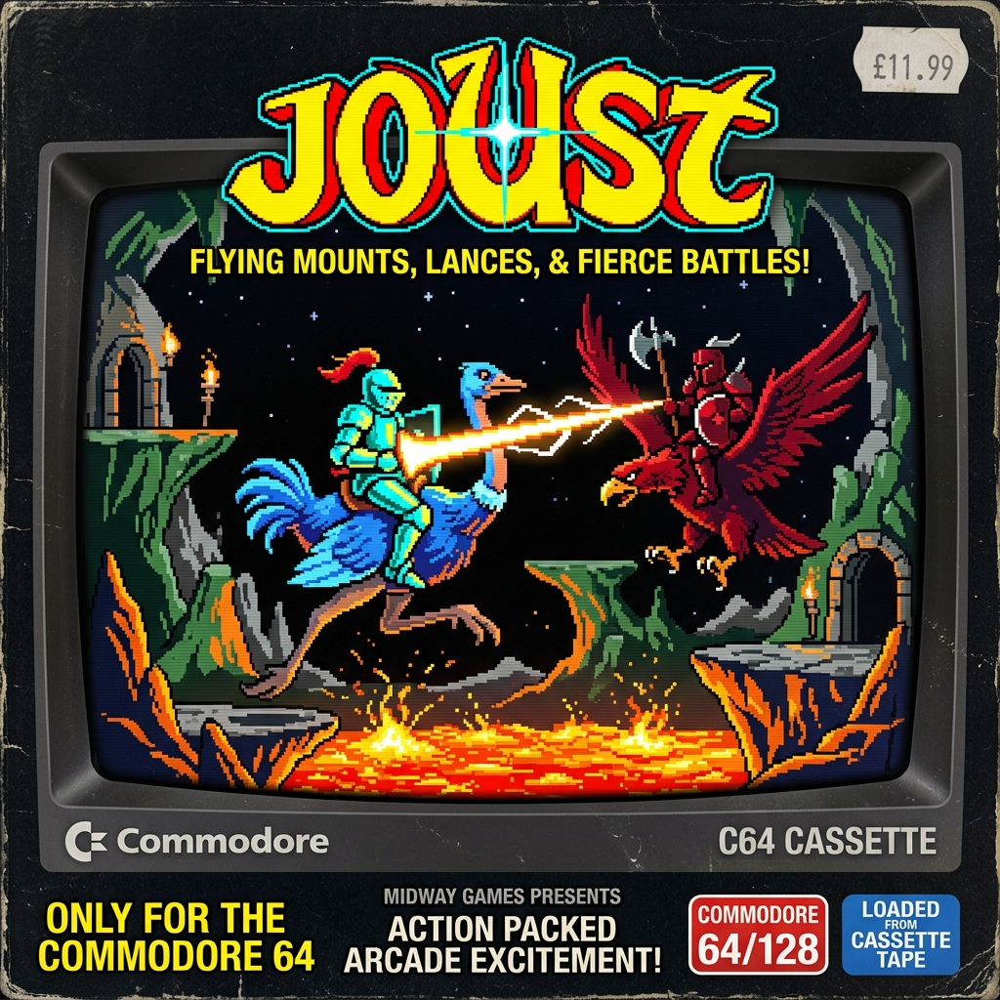
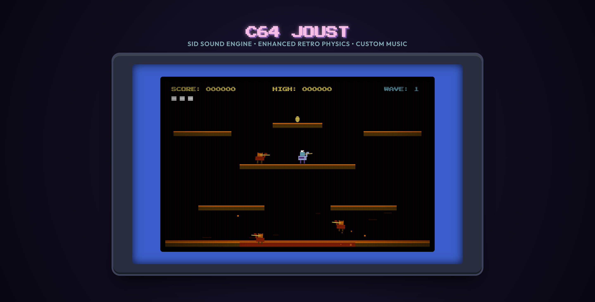

# C64 JOUST: Enhanced Retro Edition

A high-end, web-based arcade replica of the 1982 classic **Joust**, themed with the visual styling and sound characteristics of the Commodore 64 (C64) home computer system. 

## 🎮 Play Game Live: [enzocage.de/code/joust](https://enzocage.de/code/joust)



*Gameplay Screenshot:*


## Features

### 📺 Retro CRT Bezel Simulator
* **Curved Screen Distortion**: Custom CSS layout mimicking the round face of an 80s cathode-ray tube television.
* **Scanline & Phosphor Overlay**: Transparent linear gradients simulating screen refresh lines and color aberrations.
* **Blinking C64 LOAD prompt**: Blinks dynamically to mimic retro terminal invitations.
* **C64 Border Flashing**: The screen border flashes **green** on victorious jousts, **red** on player deaths, and **yellow** when a boss spawns.

### 🔊 Enhanced SID Sound Synthesis
Bypasses generic sound assets to synthesize 10 action-triggered audio effects using the **Web Audio API**:
1. **Flap (Air)**: Quick, airy frequency sweep for regular mid-air thrusts.
2. **Flap (Heavy Launch)**: Deep, low-frequency triangle wing beats when taking off from platforms.
3. **Joust Clash**: A blend of metallic high-sine ring modulation and white noise crackling.
4. **Shield Deflect**: A resonant high-frequency ping when a shield absorbs a hit.
5. **Death Explosion**: A broad low-pass filtered noise burst combined with a descending sweep.
6. **Lava Bubble Pop**: A hollow, short sine burst when magma bubbles pop.
7. **Pterodactyl Warning Screech**: An oscillating, high-pitch alarm siren indicating boss arrival.
8. **Pterodactyl Slay Chime**: A sparkling rising chord fanfare upon defeating the boss.
9. **Wave Victory Fanfare**: A short arpeggiated C-major C64 jingle when all enemies are cleared.
10. **Low Life Alarm**: A dual-pulse beep pattern indicating you are down to your last life.

### 🏃 High-End Retro Physics & Animation
* **Seamless Edge Wrap-around**: When crossing screen boundaries, entities are drawn simultaneously on both left and right edges (split-rendering), removing graphical popping.
* **Procedural Walk Leg Cycle**: Ostrich legs animate dynamically across a 3-frame running loop while walking, and tuck upward during flights.
* **Landing Squash & Stretch**: Impacting platforms compresses your ostrich vertical scale and stretches it horizontally, before springing back.
* **Speed Leaning**: Ostriches skew and tilt forward/backward dynamically to reflect flight momentum.
* **Flexing Lava Claw**: The bottom lava hand rises with independent finger joints that flex and clasp tightly when grabbing entities.

### 🎮 Gameplay Elements
* **Upgraded AI**: Enemies dynamically dodge the rising lava hand and fight for altitude superiority.
* **Pterodactyl Boss**: Spawns if a wave takes longer than 35 seconds. Flies rapidly, tracking your height. Can only be slain by hitting its beak directly.
* **Power-up Drops**: Golden eggs grant double points and speed boosts (making your lance glow white); shield drops absorb one low-height collision.
* **Initials Scoreboard**: Local leaderboard saving the top 5 scores persistently in `LocalStorage` with retro 3-letter name inputs.

---

## Getting Started

### Prerequisites
Make sure you have [Node.js](https://nodejs.org/) installed.

### How to Run Locally
1. Run the local Node.js static server:
   ```bash
   node server.js
   ```
2. Open your browser and navigate to:
   **[http://localhost:8000/](http://localhost:8000/)**
3. Click the blinking **LOAD "JOUST",8,1** button to start!

---

## Game Controls

| Key / Button | Action |
| --- | --- |
| **Space** / **W** / **Up Arrow** | Flap wings (Gain height) |
| **A** / **Left Arrow** | Navigate Left |
| **D** / **Right Arrow** | Navigate Right |
| **M** | Toggle Mute/Unmute sound effects |
| **Mobile Virtual Buttons** | On-screen D-Pad and FLAP buttons |

---

## Technical Architecture

### Physics Logic
The movement is governed by standard kinematic updates:
$$\text{Gravity} = 0.18 \text{ px/frame}^2$$
$$\text{Air Friction} = 0.94$$

Platforms perform axis-aligned bounding box (AABB) checks:
```javascript
if (entity.x + entity.width > plat.x && entity.x < plat.x + plat.w) {
  // Top landing check
  if (entity.y + entity.height >= plat.y && entity.y + entity.height - entity.vy <= plat.y + 6) {
    entity.y = plat.y - entity.height;
    entity.vy = 0;
  }
}
```

### Joust Rule Comparisons
Jousting collisions compare the vertical center coordinates of colliding riders:
* If Player Center is **lower** than Enemy Center $\rightarrow$ Player loses a life (or shield).
* If Player Center is **higher** than Enemy Center $\rightarrow$ Enemy turns into an egg.
* If centers are equal (within a 4-pixel tolerance) $\rightarrow$ Entities bounce off each other horizontally.
